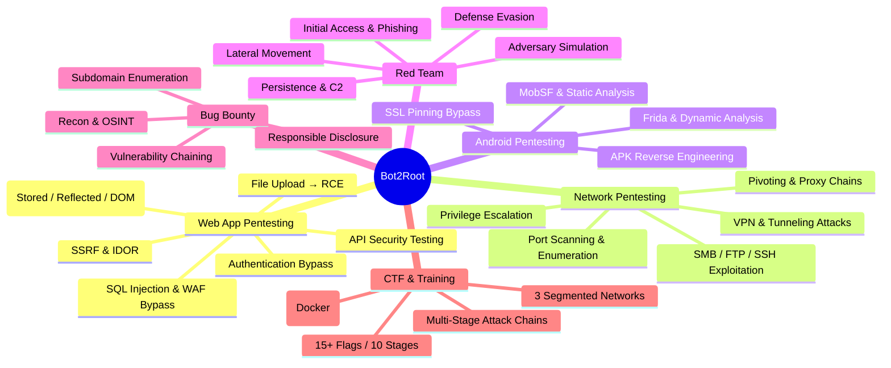

<h1 align="center">Hey there! I'm Raghuveer Singh Chouhan 👋</h1>

  <em>Cybersecurity Engineer | Bug Bounty Hunter | Pentester | Red Team Operator</em>

  <a href="https://www.youtube.com/@Bot2Root">📺 YouTube</a> •
  <a href="https://www.instagram.com/bot2root">📸 Instagram</a> •
  <a href="https://github.com/Bot2Root24">💻 GitHub</a>

---

### 🔐 What I Do

I'm a **Cybersecurity Engineer** specializing in **offensive security** — Web Application Pentesting, Network Pentesting, Android Pentesting, Bug Bounty Hunting, and Red Team Engagements. I find vulnerabilities before the bad guys do, simulate adversary tactics to test defenses, and help organizations strengthen their security posture.

I also design and build **CTF (Capture The Flag) labs** that simulate real-world multi-stage attack chains — from initial web exploitation to privilege escalation and network pivoting. On the side, I create **cybersecurity content** on YouTube and Instagram under the **Bot2Root** brand, covering pentesting techniques, tool walkthroughs, and security concepts for the community.

---

### 🛠️ Tech Stack

<b>Languages</b>

 

<b>Security & Offensive Tools</b>

 

<b>Infrastructure & Tools</b>

 

---

### 🚀 Featured Projects

| Project | Description | Tech |
|---------|-------------|------|
| [**Bot2Root CTF-01**](https://github.com/Bot2Root24/Bot2Root-CTF-01) | Multi-stage pentest CTF lab with 11 Docker containers across 3 segmented networks — 15+ flags, 10 attack stages | Docker, Python, Shell |
| [**Cybersecurity Mind Map**](#-mind-map) | Visual mind map of my offensive security skill tree — see below | Markdown, Mermaid |

---

### 🧪 What I'm Into

- **Web Application Pentesting** — SQLi, XSS, SSRF, RCE, IDOR, file upload bypasses, WAF evasion, API security
- **Network Pentesting** — Port scanning, service enumeration, SMB/FTP exploitation, VPN attacks, pivoting & tunneling
- **Android Pentesting** — APK reverse engineering, Frida hooking, MobSF analysis, SSL pinning bypass
- **Red Team Engagements** — Adversary simulation, initial access, lateral movement, persistence, C2 operations
- **Bug Bounty Hunting** — Finding and responsibly disclosing vulnerabilities in production systems
- **CTF Lab Design** — Building realistic multi-stage attack environments with Docker
- **Security Content Creation** — YouTube & Instagram tutorials for the cybersecurity community

---

### 🧠 Mind Map

---

### 📊 GitHub Stats

  

  

  
  

---

  <em>"The best way to learn security is to build the lab yourself — then break it."</em>

